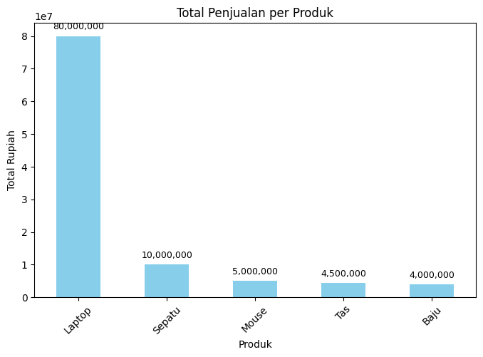

# nengah2026-portofolio
Repo ini berisi project harian gue buat belajar Data Analyst dari nol sampai bisa.

## Day 1: SQL Basics
Belajar query dasar SQL buat analisis data penjualan.

**Yang dikerjain:**
1. SELECT, WHERE, ORDER BY, GROUP BY
2. JOIN 2 tabel: orders & customers
3. Agregasi total penjualan per bulan

**Tools**
- PostgreSQL
- DBeaver

---
## Day 2: Python Pandas Fundamentals
Eksplorasi data CSV pakai Pandas.

**Yang dikerjain:**
1. Baca CSV pake `pd.read_csv()`
2. `head()`, `info()`, `describe()`
3. Filter data pake boolean indexing

**Tools**
- Python
- Pandas

---
## Day 3: Data Visualization with Python
Visualisasi data penjualan biar gampang dibaca.

**Yang dikerjain:**
1. Load data pakai pandas
2. Bikin Bar Chart untuk total penjualan per produk
3. Bikin Line Chart untuk tren penjualan bulanan

**Tools**
- Python
- Pandas
- Matplotlib
- Seaborn
- Google Colab

---
## Day 4: Sales Data Automation with Python
Otomasi laporan penjualan bulanan pakai Python.

**Yang dikerjain:**
1. Auto load data dari Excel
2. Generate grafik tren penjualan
3. Export hasil ke folder laporan

**Tools**
- Python
- Pandas
- Openpyxl
- Matplotlib

---
## Day 5: Analisis Penjualan dengan Python
Analisis penjualan pake Pandas buat nemuin produk terlaris.

**Yang dikerjain:**
1. Load file penjualan.csv pakai pandas di Google Colab
2. Group data buat cari produk terlaris
3. Baca hasil analisis dan bikin kesimpulan

**Hasil:**
- Produk Ebook Copywriting & Template IG paling banyak terjual (3x)
- Total pendapatan tertinggi dari Ebook Copywriting
- Task selesai dalam 15 menit

**Tools**
- Python
- Pandas
- Google Colab

---
## Day 6: Trend Penjualan per Produk
Analisis tren penjualan & visualisasi pake Pandas + Matplotlib.

**Yang dikerjain:**
1. Grouping data penjualan per produk
2. Bikin grafik batang total penjualan
3. Insight produk terlaris

**Hasil:** Grafik batang total penjualan per produk  
**Notebook:** Lihat file `day6_tren_penjualan_final.ipynb` di repo ini  
**Tools:** Python, Pandas, Matplotlib

## Day 7: Dashboard Penjualan Interaktif

Upgrade analisis Day 6 jadi dashboard web interaktif pake Streamlit. Upload CSV → filter → grafik auto update.

Yang dikerjain:
1. Bikin dashboard pake Streamlit + upload file CSV
2. Tambah filter produk di sidebar biar data bisa dipilih
3. Bikin KPI card: total penjualan, total jumlah, rata2 harga
4. Visualisasi grafik batang + scatter harga vs jumlah
5. Fitur download hasil filter ke CSV gratis

Hasil: Dashboard web interaktif bisa upload data & download hasil filter
Notebook/Script: Lihat file `day7_dashboard.py` di repo ini
Tools: Python, Streamlit, Pandas, Matplotlib

